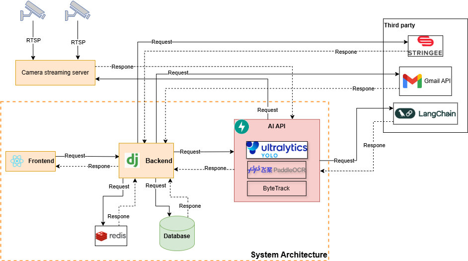

# 🛵 Helmet Violation Detection System for Motorcyclist

This project aims to automatically detect helmet violations of motorcyclists in Vietnam using computer vision and deep learning technology. The project helps improve traffic safety by identifying individuals riding without helmets in videos or live streams. We focus on developing the project to be able to meet the practical implementation capabilities of traffic conditions in Vietnam, especially from traffic camera systems.

---

## System Design



### 📡 Camera Streaming Server
IP cameras transmit video data via the **RTSP** protocol to a **Streaming Server**. This server is responsible for distributing video streams on demand to subsequent processing components.


### 🖥️ Frontend (User Interface)
The **web interface**, developed using **ReactJS**, allows users to:

- Monitor live streams.
- Search for violation events.
- Manage system and user information.

The frontend sends requests to the backend and displays the received responses.


### 🧠 Backend
The **Backend**, built with the **Django** framework, serves as the core coordinator:

- Receives requests from the frontend.
- Connects to **Redis** and **Database** for data storage and retrieval.
- Receives violation results from the AI Service.
- Interacts with external services such as **Gmail API** and **Stringee**.


### 🤖 AI API (Artificial Intelligence Service)
The **AI service** is responsible for computer vision tasks:

- **Object Detection (YOLO Ultralytics)**: Detects motorcycles, helmets/no helmets, and license plates.
- **PaddleOCR**: Recognizes motorcycle license plates.
- **ByteTrack**: Tracks objects across consecutive frames.

The AI API receives requests from the backend and returns recognition results.


### 🗃️ Database
Stores all system-related data, including:

- Violation license plate data and extracted evidence images.
- System information such as locations and cameras.
- User information and access roles.

### 🌐 External Services
- **Stringee**: Provides voice/SMS call center support for user authentication.
- **Gmail API**: Automatically sends violation notification emails.
- **LangChain**: Assists with extracting information from motorcycle registration certificates.


## Project Structure
```
VIETNAM_MOTOBIKE_HELMET_VIOLATION_RECOGNITION/
  ├── AI/ # AI pipeline  
  ├── BE/ # Django Backend
  ├── FE/ # Reactjs 
  ├── README.md # Project overview (this file)
  ├── images 
```

## Branch Structure

This repository follows a structured branching strategy to support stable releases, ongoing development, and experimental features:

- **`main`**  
  The production-ready branch. Always contains the latest stable version of the project.

- **`AI-pipeline`**  
  Focuses on the integration and development of the core AI modules such as object detection, tracking, and OCR. This is the main branch for evolving the AI logic and handling inference pipelines.

- **`Frontend`**  
  Dedicated to the development of the ReactJS-based user interface. Includes work related to UI/UX, live stream display, event monitoring, and user interaction components.

- **`Backend`**  
  Handles development and maintenance of the Django backend. This includes API logic, user management, and communication with external services.

- **`stimulate_streaming`**  
  A specialized branch used to test or simulate video stream handling.

- **`eda_training_model`**  
  Contains scripts, notebooks, and code used for exploratory data analysis (EDA) and model training. Supports experimenting with model improvements, dataset inspection, and evaluation workflows.

Each branch has a focused purpose, which helps the team work in parallel and merge features cleanly from three branch: **`AI-pipeline`**, **`Frontend`**, **`Backend`** into the main production flow.

---

## Participants
1. Le Huy Hoan - AI Engineer + Team Leader
- Major: Artificial Intelligence
- Contact:
   + Github: huyhoanlee
   + Gmail: hoanle2003@gmail.com
2. Nguyen Son Tung - AI Engineer
- Major: Artificial Intelligence
- Contact:
   + Github: tungns
   + Gmail: Nstung463@gmail.com
3. Hoang Ngoc Xuan Nguyen - AI + BE Developer
- Major: Artificial Intelligence
- Contact:
   + Github: hanak3
   + Gmail: hoangnguyen01022003@gmail.com
4. Dang Thi Le Chi - AI Engineer
- Major: Artificial Intelligence
- Contact:
   + Github: DangLeChi
   + Gmail: chidtl79@gmail.com
5. Nguyen Trung Kien - FE Developer
- Major: Software Engineering
- Contact:
   + Github: Kiennt1699
   + Gmail: kien.nguyentrung1699@gmail.com
