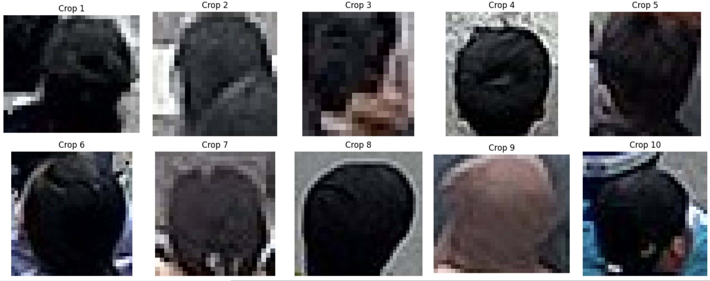
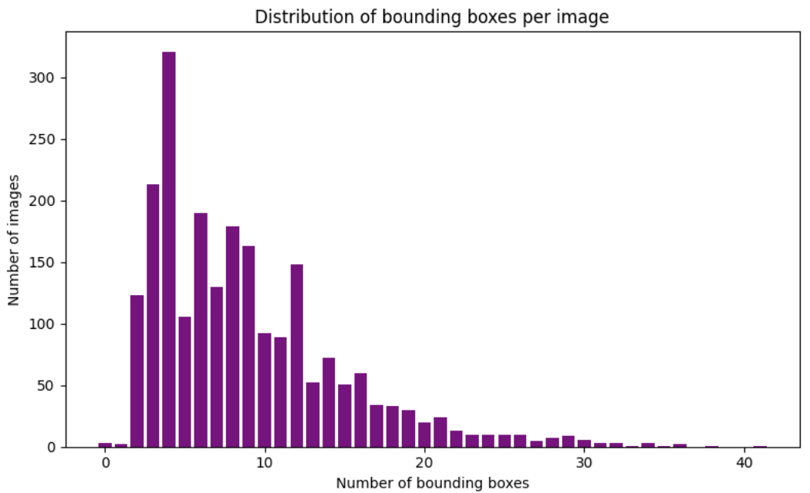
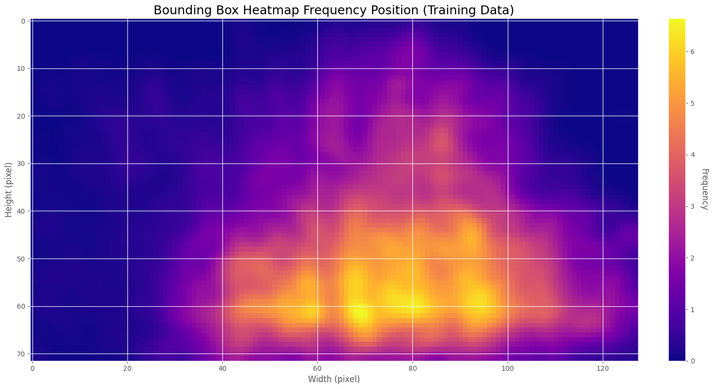
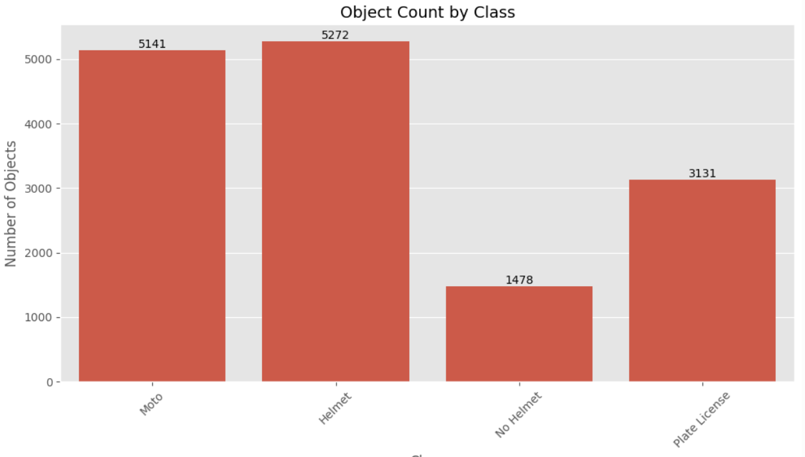
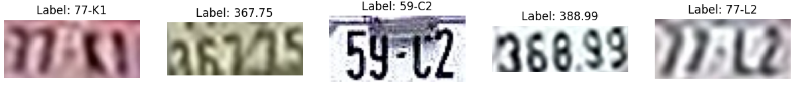
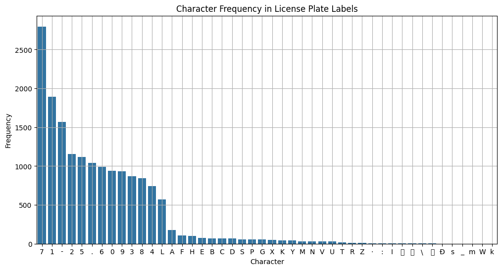
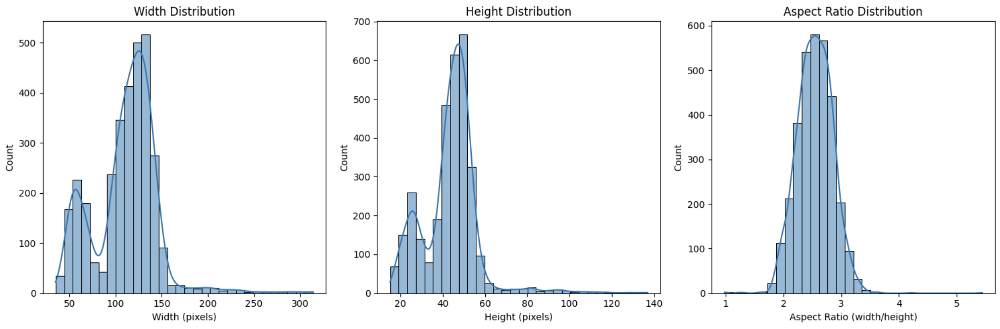

# 📊 Dataset Analysis Report

This document provides a comprehensive analysis of the datasets used in Object Detection (OD) and Optical Character Recognition (OCR) tasks. The visualizations presented below offer insights into the structure of the dataset, class distributions, bounding box sizes, spatial arrangements, and other key metrics that are crucial for model development and evaluation.

---

## 🧠 Object Detection (OD)

### 1. **Sample Images – Class: `no_helmet`**

Representative samples of the `no_helmet` class, including bounding box annotations. These examples provide a qualitative view of data annotation and typical real-world scenarios.

  

---

### 2. **Bounding Box Size Distribution**

This plot shows the distribution of bounding box sizes (width × height). It helps inform anchor box selection and model robustness to object scale variance.

  

---

### 3. **Spatial Distribution of Object Center Points**

A heatmap visualizing where object centers most frequently appear in the image frame. This analysis is useful for detecting potential spatial bias or scene framing tendencies.

  

---

### 4. **Class Distribution**

This chart highlights the frequency of each class in the object detection dataset. Class imbalance is an important factor to consider when developing classification or detection models.

  

---

## 🔤 Optical Character Recognition (OCR)

### 1. **Example Plate Image**

A sample license plate used in OCR tasks to illustrate typical input image characteristics.

  

---

### 2. **Character Frequency in License Plate Labels**

This bar chart shows the occurrence of individual characters (A–Z, 0–9) in the license plate dataset. A well-distributed frequency supports better model generalization across the character space.

  

---

### 3. **Resolution and Aspect Ratio Distribution**

This visualization summarizes the distribution of image resolutions and aspect ratios across the OCR dataset. It provides insights for optimizing preprocessing pipelines and input configurations.

  

---

## 🧾 Conclusion

The exploratory data analysis presented above highlights several key characteristics of the datasets:

- The object detection dataset includes a diverse range of samples, with visible class imbalance and variation in object sizes and spatial distributions. These factors should be considered when selecting model architectures and training strategies.
- The OCR dataset demonstrates a generally well-balanced character frequency, though resolution and aspect ratio diversity suggests the need for flexible preprocessing.
- Overall, the datasets appear to be of good quality for training robust deep learning models, provided that augmentation, normalization, and class balancing techniques are appropriately applied.

This analysis serves as a foundational step for designing effective pipelines in both object detection and OCR tasks.
